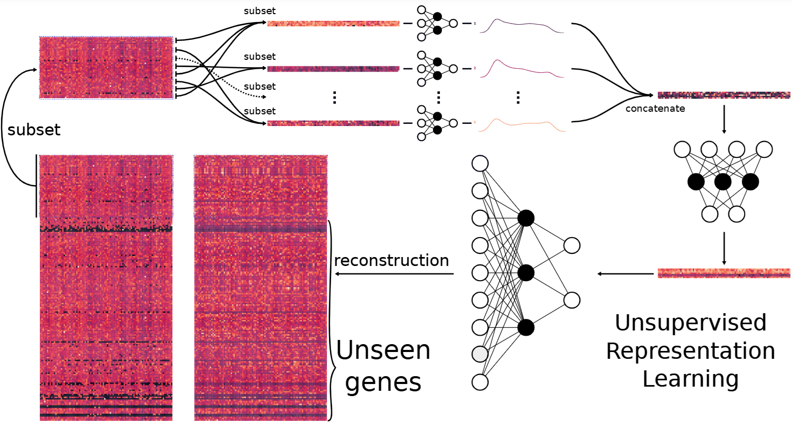

# PAAE-reproduction
Self-contained reproduction and pathway analysis of the Pathway Activity Autoencoder (PAAE) for breast cancer gene-expression data

## The problem 
Current cancer analysis methods face a trade-off: Traditional methods can be easier to interpret but may struggle to capture complex biological patterns. Whereas, powerful deep learning systems that can capture these patterns may operate as opaque black boxes. To address this, researchers have begun incorporating known biological pathways by injecting known medical and biological facts (like how genes interact) directly into model architectures before training starts. 

Additionally, gene sets can be large and messy, often containing thousands of individual genes. Instead of forcing a model to look at every one, researchers bundle related genes together into a single summary score called a Pathway Activity (PA) score. The authors introduce their own creation, PAAE, which gives a single, easy-to-read score for a biological pathway, whilst also letting those pathways interact naturally because they built biological rules into the structure of the model. The model is lightweight, and uses less parameters than naive variants.

## My Contribution 
* Created two self contained, organised easy to understand Jupyter Notebooks for reproduction and analysis.
* Reproduced the PAAE model based on the authors' published implementation.
* Made the implementation self-contained rather than relying on the original repository's model definitions.
* Prepared and processed TCGA-BRCA gene-expression and clinical data.
* Performed breast-cancer subtype classification using the learned representations and logistic regression.
* Performed external validation using the independent METABRIC dataset.
* Investigated pathway/gene overlap using KEGG and Hallmark pathway definitions.
* Produced statistical summaries, recurrence histograms and pathway-overlap visualisations.

## Known differences from the paper 
* Gene expression: I used STAR-FPKM pipeline instead of the paper's HTSeq-FPKM (Xena has retired the HTSeq version for this cohort).
* METABRIC gene expression: I used `data_mrna_illumina_microarray.txt` instead of the paper's `data_mrna_agilent_microarray.txt.gz` (the Agilent file is no longer available in the current METABRIC download).
* Pathway definitions: current MSigDB release (v2026.1), renamed to match `v7.5.1` filenames, rather than the exact archived v7.5.1 files.
* I used a single classifier (Logistic Regression) and 100 epochs instead of 1024 like the paper.
* I used a single train/test split and fixed the architecture. I used 100 epochs instead of the paper's 1024 and did not perform grid search or cross-validated model selection.
* I focused on reproducing the PAAE model and subtype classification, so I did not implement PAVAE, survival analysis, feature importance/ANPW analysis, or clustering.

## Results
TCGA-BRCA test accuracy | 0.853
METABRIC external-validation accuracy | 0.0843
METABRIC ROC AUC | 0.7502

Metric  |   Value
--------|------
TCGA-BRCA test accuracy    |   0.853
METABRIC external-validation accuracy     |   0.0843
METABRIC ROC AUC   |   0.7502

## Method 

### Pathway aware representation learning:

Gene expression data from TCGA-BRCA is provided to the PAAE model. The model uses 80% of the data to train and 20% to test. The model takes the 80% subset and uses the predefined KEGG and Hallmark gene sets to associate genes with their corresponding pathways. Each pathway is condensed into a single pathway activity score using a small neural network, and each activity score is combined into a single activity vector. The activity vector is compressed into a latent representation of significantly fewer dimensions using a neural network. This latent representation is passed into the reconstruction neural network which tries to reconstruct the original subset. 

### Downstream analysis:

The learned representations are used for breast-cancer subtype classification using logistic regression. The classifier predicts the PAM50 breast-cancer subtype from the representation learned by PAAE. The trained model is then evaluated on the independent METABRIC dataset. 

### Pathway overlap analysis:

Because individual genes can occur in multiple biological pathways, I created a second Jupyter Notebook that investigates the degree of overlap between the KEGG and Hallmark pathway definitions used by the models. 

### The analysis includes:
* Total number of genes in the TCGA-BRCA and METABRIC datasets
* Number and percentage of genes covered by the KEGG and Hallmark pathway definitions
* Combined KEGG and Hallmark pathway coverage
* Coverage of the genes shared between TCGA-BRCA and METABRIC
* Intersection and union of the pathway gene sets
* Minimum, maximum and mean number of genes per pathway
* Gene recurrence histograms
* Pathway-overlap heatmaps

## Pipeline 
```text
TCGA-BRCA gene expression
          ↓
     PAAE model
          ↓
   Pathway Activity
          ↓
  Latent representation
          ↓
  Logistic Regression
          ↓
 Breast cancer subtype
          ↓
METABRIC external validation
```


## Limitations 

The notebook uses a fixed random seed to make the training procedure reproducible. Before fixing the seed, rerunning the notebook produced noticeably different results: TCGA test accuracy stayed around 0.81 to 0.84, but METABRIC accuracy ranged from around 0.08 to 0.33, with prediction sometimes collapsing onto one or two subtypes instead of spreading across all five. ROC AUC was more stable around 0.73 to 0.79. This variability must be related to the reduced epoch count (100 vs the paper's 1024), but that wasn't tested directly. The final results reported above therefore correspond to the fixed-seed run.

## Data 
* TCGA-BRCA: Breast cancer gene-expression and clinical data.
* METABRIC: Independent breast cancer dataset used for external validation.
* KEGG: 186 pathway definitions.
* Hallmark: 50 pathway definitions.

## References
* Original paper: 

